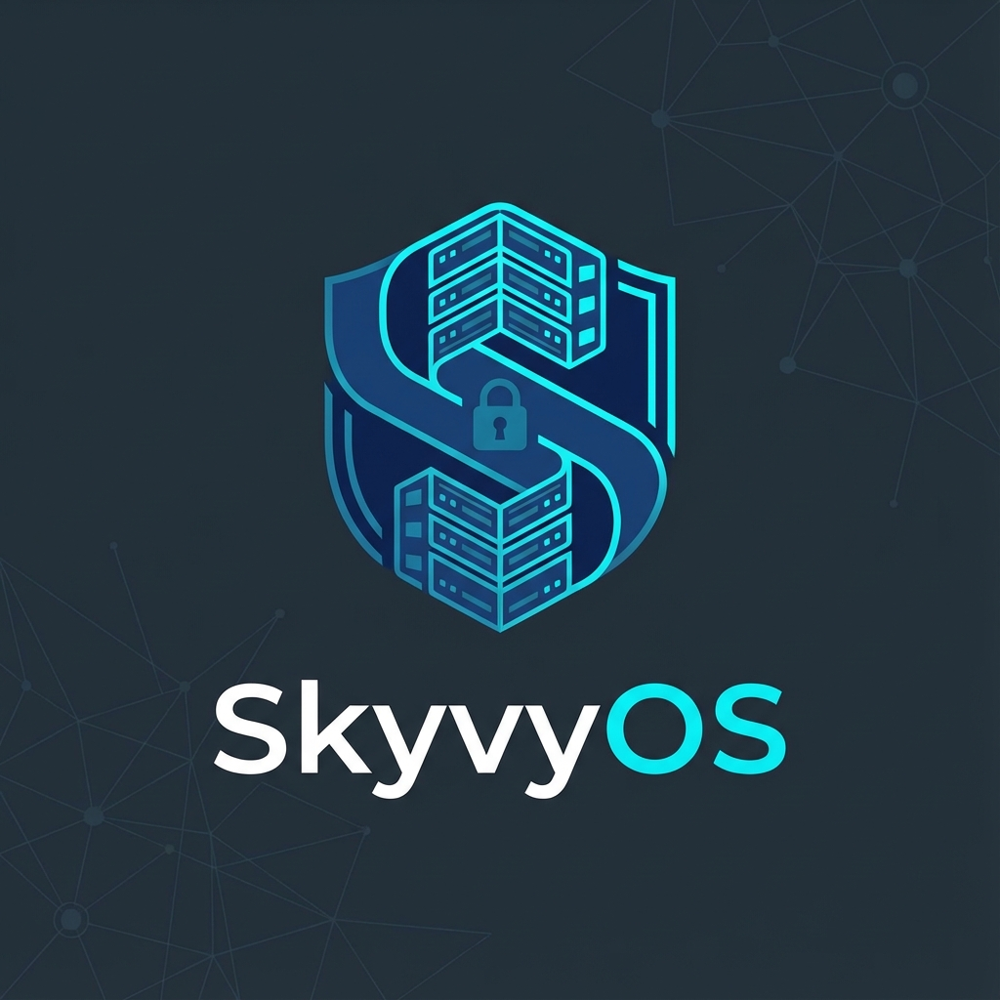

# 🛡️ SkyvyOS Secure Server

<div align="center">
  
</div>


**Enterprise Security-Hardened Debian Server Distribution**

SkyvyOS Secure Server adalah distribusi Linux server yang di-hardening dengan keamanan tingkat enterprise, dibangun di atas Debian 12 (Bookworm). Dirancang untuk deployment produksi dengan keamanan enterprise, performa tinggi, dan kemudahan deployment.

---

## 🌟 Features

| Feature | Description |
|---------|-------------|
| ✨ **Lightweight & Fast** | Footprint minimal dengan layanan esensial saja |
| 🔒 **Security Hardened** | CIS compliance, kernel hardening, nftables firewall |
| 🛡️ **Intrusion Prevention** | Fail2Ban, AppArmor, Audit daemon |
| 🚀 **Production Ready** | Pre-configured Nginx, Docker, dan runtime populer |
| 📦 **Automated Deployment** | Preseed untuk instalasi otomatis |
| ☁️ **VM Template Ready** | Proxmox, VMware, VirtualBox ready |
| 💻 **Multi-Language** | 24+ bahasa pemrograman terinstall |
| 🎯 **CLI Only** | Tanpa GUI, dioptimalkan untuk server |

---

## 📋 System Requirements

| Component | Minimum | Recommended |
|-----------|---------|-------------|
| **CPU** | 1 core | 2+ cores |
| **RAM** | 512 MB | 2 GB+ |
| **Disk** | 10 GB | 20 GB+ |
| **Network** | Internet | Static IP |
| **Base OS** | Debian 12 | Debian 12 |

---

## 📖 Tata Cara Instalasi

### Metode 1: Instalasi dari Debian Minimal (Recommended)

#### Langkah 1: Install Debian 12 Minimal
Download dan install Debian 12 Bookworm dari [debian.org](https://www.debian.org/distrib/netinst) menggunakan netinst ISO.

#### Langkah 2: Download Script Installer
```bash
# Login sebagai root atau user dengan sudo
sudo apt update && sudo apt install -y wget git

# Clone repository
git clone https://github.com/MuhammadLutfiMuzakiiVY/SkyvyOS-Secure-Server.git
cd SkyvyOS-Secure-Server
```

#### Langkah 3: Jalankan Installer
```bash
sudo chmod +x scripts/install-skyvyos.sh
sudo bash scripts/install-skyvyos.sh
```

#### Langkah 4: Reboot Sistem
```bash
sudo reboot
```

---

### Metode 2: Build Custom ISO

#### Langkah 1: Siapkan Build Environment
```bash
# Di sistem Debian/Ubuntu
sudo apt update
sudo apt install -y live-build debootstrap squashfs-tools genisoimage syslinux isolinux xorriso
```

#### Langkah 2: Clone Repository
```bash
git clone https://github.com/MuhammadLutfiMuzakiiVY/SkyvyOS-Secure-Server.git
cd SkyvyOS-Secure-Server
```

#### Langkah 3: Build ISO
```bash
sudo chmod +x scripts/build-skyvyos-iso.sh
sudo bash scripts/build-skyvyos-iso.sh
```

#### Langkah 4: Hasil ISO
File ISO akan berada di folder `build/`:
```
SkyvyOS-Secure-Server-YYYYMMDD-HHMMSS.iso
```

#### Langkah 5: Install dari ISO
1. Boot dari USB/DVD yang berisi ISO
2. Pilih "Install SkyvyOS Secure Server"
3. Ikuti wizard instalasi
4. Sistem akan otomatis hardened setelah reboot

---

### Metode 3: Deploy ke Virtual Machine

#### Proxmox VE
```bash
# Di node Proxmox
sudo bash scripts/prepare-proxmox-template.sh
```

#### VMware/VirtualBox
```bash
# Setelah install SkyvyOS
sudo bash scripts/prepare-vm-template.sh
```

---

## 🔧 Post-Installation

### Cek Status Sistem
```bash
# Tampilkan informasi sistem
skyvyos-info

# Audit keamanan
sudo skyvy-security-audit

# Status firewall
sudo nft list ruleset
```

### Konfigurasi SSH Key
```bash
# Buat SSH key di komputer lokal
ssh-keygen -t ed25519 -C "your-email@example.com"

# Copy ke server
ssh-copy-id -i ~/.ssh/id_ed25519.pub user@server-ip
```

### Buka Port Tambahan
```bash
# Contoh: Buka port 8080
sudo nft add rule inet filter input tcp dport 8080 accept
sudo nft list ruleset > /etc/nftables.conf
```

---

## 📁 Struktur Project

```
SkyvyOS-Secure-Server/
├── 📁 branding/           # Branding files (MOTD, os-release, dll)
├── 📁 config/             # Konfigurasi sistem
│   ├── nftables.conf      # Firewall rules
│   ├── sshd_config        # SSH hardening
│   ├── sysctl-hardening   # Kernel security
│   └── packages.list      # Daftar packages
├── 📁 docs/               # Dokumentasi lengkap
├── 📁 kubernetes/         # K8s deployment files
├── 📁 preseed/            # Automated installation
├── 📁 scripts/            # Installer & tools
│   ├── install-skyvyos.sh     # Main installer
│   ├── build-skyvyos-iso.sh   # ISO builder
│   └── skyvy-security-audit   # Security auditor
└── 📄 README.md           # File ini
```

---

## 🛡️ Security Features

| Layer | Protection |
|-------|------------|
| **Kernel** | Hardened sysctl, ASLR, exec-shield |
| **Network** | nftables firewall, rate limiting |
| **Auth** | SSH key-only, 2FA ready, PAM hardening |
| **Intrusion** | Fail2Ban, AIDE, Auditd |
| **Access** | AppArmor mandatory access control |
| **Updates** | Automatic security patches (unattended-upgrades) |

---

## 💻 Default Software Stack

### Web & Server
- **Nginx** - High-performance web server
- **Docker & Compose** - Containerization platform
- **Certbot** - Let's Encrypt SSL certificates

### Programming Languages
- Python 3 + pip + venv
- Node.js LTS + npm
- PHP 8.x + Composer
- Go, Rust, Ruby, Java, C/C++
- Dan 20+ bahasa lainnya

### Security Tools
- Fail2Ban - Intrusion prevention
- AIDE - File integrity monitoring
- Auditd - System auditing
- ClamAV - Antivirus (optional)

### Monitoring
- htop, iotop, vnstat
- journalctl logs
- Custom skyvy-security-audit

---

## 🆘 Troubleshooting

### SSH Connection Refused
```bash
# Pastikan SSH service running
sudo systemctl status ssh

# Cek firewall
sudo nft list ruleset | grep ssh
```

### Permission Denied
```bash
# Pastikan SSH key sudah di-copy
cat ~/.ssh/authorized_keys

# Cek permission
chmod 700 ~/.ssh
chmod 600 ~/.ssh/authorized_keys
```

### Service Not Starting
```bash
# Cek log service
sudo journalctl -u SERVICE_NAME -xe

# Restart service
sudo systemctl restart SERVICE_NAME
```

---

## 📚 Dokumentasi Lengkap

| Dokumentasi | Deskripsi |
|-------------|-----------|
| [Architecture](docs/SkyvyOS-Architecture.md) | Arsitektur sistem |
| [Deployment Guide](docs/DEPLOYMENT-GUIDE.md) | Panduan deployment |
| [Security Architecture](docs/SECURITY-ARCHITECTURE.md) | Arsitektur keamanan |
| [VM Template Guide](docs/VM-TEMPLATE-GUIDE.md) | Panduan template VM |
| [Quick Reference](docs/QUICK-REFERENCE.md) | Reference cepat |
| [Getting Started (ID)](GETTING-STARTED-ID.md) | Panduan Bahasa Indonesia |

---

## 📄 License

GNU General Public License v3.0 - Lihat file [LICENSE](LICENSE)

---

## 🤝 Contributing

Kontribusi sangat diterima! Fork repository ini dan kirim Pull Request.

---

## 📧 Support

- **GitHub Issues**: [Open Issue](https://github.com/MuhammadLutfiMuzakiiVY/SkyvyOS-Secure-Server/issues)
- **Documentation**: Lihat folder `docs/`

---

<div align="center">

**🔒 SkyvyOS Secure Server**  
*Enterprise Security-Hardened Linux Distribution*

Made with ❤️ for Security

</div>
